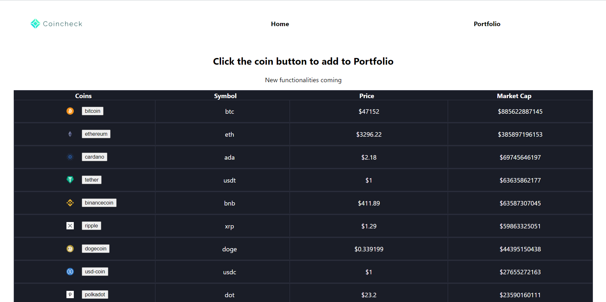

# Project Name
> Outline a brief description of your project.
> Live demo [_here_](https://cryptotracker13.herokuapp.com/). <!-- If you have the project hosted somewhere, include the link here. -->

## Table of Contents
* [General Info](#general-information)
* [Technologies Used](#technologies-used)
* [Features](#features)
* [Screenshots](#screenshots)
* [Project Status](#project-status)
* [Room for Improvement](#room-for-improvement)
* [Contact](#contact)
<!-- * [License](#license) -->

## General Information
- What is the purpose of your project?

The purpose of this project was to get better at my Javascript and CSS skills.

- Why did you undertake it?

I did it for my passion on cryptocurrency and because of the euphoria that has been happening lately on cryptos.
<!-- You don't have to answer all the questions - just the ones relevant to your project. -->

## Technologies Used
- Javascript - ES6
- HTML - version 5.1
- CSS - version 2.1

## Features
List the ready features here:
- Ability to add to portfolio.
- Live-tracking of cryptocurrencies.

## Screenshots

<!-- If you have screenshots you'd like to share, include them here. -->

## Project Status
Project is: Working on it.

## Room for Improvement
Include areas you believe need improvement / could be improved. Also add TODOs for future development.

Room for improvement:
- Colors need to change on price change.
- Add to portfolio button.

To do:
- Live notifications of price changes.
- Sharing platform with other people.

## Contact
Created by [@arstix]() - feel free to contact me!

<!-- Optional -->
<!-- ## License -->
<!-- This project is open source and available under the [... License](). -->

<!-- You don't have to include all sections - just the one's relevant to your project -->
